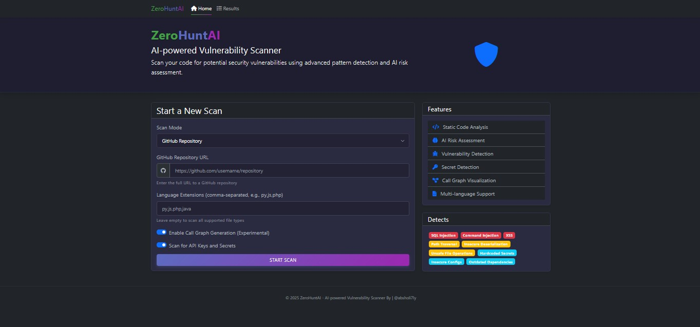

# 📖ZeroHuntAI - AI-Powered Zero-Day Vulnerability Scanner
ZeroHuntAI is an advanced, modular, and extensible source code vulnerability scanner designed to detect zero-day exploits and security weaknesses in local directories or GitHub repositories. Leveraging static code analysis, pattern matching, and AI-driven risk scoring, ZeroHuntAI empowers developers and security researchers to identify and mitigate threats like RCE, SQL Injection, XSS, and more.


## ✨ Key Features
* Multi-Mode Scanning:
* Local Scanner: Recursively analyzes .py, .php, .js, .java, .c, .cpp, .go, and more.
* GitHub Scanner: Clones and scans repositories directly from URLs.
* Buffer Overflow, SQL Injection, Command Injection, Path Traversal, XSS, Authentication Flaws, Logic Bugs, and more.
* Extracts secrets from .env and configuration files.
* AST-based parsing for deep code insights.
* Regex pattern matching for risky functions (e.g., eval(), system(), mysqli_query()).
* Contextual vulnerability detection and data flow analysis.
* AI Risk Scoring:
* Mock LLM evaluation (placeholder) to classify risks as High, Medium, or Low.
* Future-ready for integration with models like GPT-4 or LLaMA.
* Exploitation Simulation:
* Runs simulated exploits (e.g., SQLi, XSS) in an isolated Docker environment.
* User Experience:
* CLI with colored output (via rich or colorama).
* Web dashboard for interactive report browsing.
* Exploitation Simulation Engine:
* Simulates exploits in a Docker sandbox and reports success (✅) or failure (❌).
* Data Flow & Taint Analysis:
* Tracks variables from input to execution using tools like Bandit or Semgrep.
* Auto PoC Generator:
* Generates Python/Bash exploit scripts and PDF reports for each vulnerability.
* API Endpoint Analysis:
* Extracts and tests endpoints for IDOR, SSRF, and Auth Bypass.
* Interactive Call Graph:
* Visualizes function relationships and data flow in an HTML graph.
* Highlights exploitable paths in red.
* Call Graph
* Finds API keys, tokens, and sensitive data in code or configs.
* Integrates with CVE feeds to cross-check findings.
* Generates random payloads to test for Buffer Overflows and Logic Bugs.
* Auto Patch Generator:
* Suggests secure code fixes for detected issues.

## Reporting:
* JSON and HTML reports with detailed findings.
* Interactive Call Graph & Taint Flow Visualization.
  
## 🚀 Getting Started
### Prerequisites
Python
Required libraries: gitpython, ast, colorama, requests, tqdm, etc. (see requirements.txt).

## Installation
Clone the repository:
```
git clone https://github.com/yourusername/ZeroHuntAI.git
cd ZeroHuntAI
```
Install Requirements:
```
pip install -r requirements.txt
```
Usage Examples
Scan a local directory:

```
python main.py --mode local --path /path/to/code
```
Scan a GitHub repository:

```
python main.py --mode github --repo https://github.com/target/repo.git
```
Enable Call Graph visualization:

```
python main.py --mode local --path /path/to/code --enable-call-graph
```



--------------------------------------------------------------------------------


--------------------------------------------------------------------------------


--------------------------------------------------------------------------------
📜 License
This project is licensed under the MIT License - see the LICENSE file for details.
🙌 Credits
Built with ❤️ by [absholi7ly].
Inspired by open-source SAST tools and the security research community.
Report Sample

## Note
This project is in its early stages and is still under development, and we are continually working to improve it and enhance its features to provide the best performance and reliability. We welcome any suggestions or contributions from interested parties to support and improve the project.

💻 Contribution and development
Hello to all security researchers and developers to contribute to the development of ZeroHuntAI
To contribute:
* Fork Warehouse
* Add your feature
* Open Pull Request


⚠️ Legal Disclaimer
For educational use only. Unauthorized use is your responsibility.
⭐ Support the project by giving it a Star!

